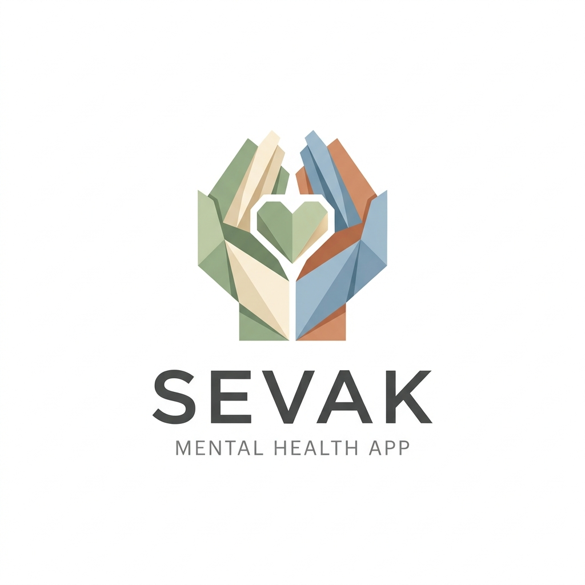

# Sevak - Personal Mental Health Companion

Sevak is an intelligent, full-stack mental health support and tracking platform. Designed to provide a safe, engaging, and supportive environment, Sevak aims to predict stress, prevent burnout, and support emotional wellness using AI-driven tools and human volunteer networks.

<div align="center">
  
</div>

## 🌟 Key Features

### 👤 For Users
- **AI-Powered Chat (Sevak AI)**: Private, real-time conversational support powered by Mistral AI, capable of analyzing sentiment and detecting dominant emotions automatically.
- **Intelligent Volunteer Matching**: When users request human support, Mistral AI algorithms evaluate their recent mood logs and match them with the most suitable volunteer based on expertise (e.g., anxiety, depression, burnout).
- **Mood Tracking & Analytics**: Log moods manually or have them auto-detected from chat conversations. Visualized using interactive Chart.js graphs.
- **Mood-Responsive Music Player**: A built-in YouTube music player that curates dynamic, multi-track playlists tailored precisely to your current emotional state (e.g., "Chill Ambient" for stress, "Upbeat Pop" for happiness).
- **Anonymous Community Feed**: Share thoughts, ask questions, and engage with others. Regular users are kept anonymous to maintain privacy and safety.
- **Mental Health Assessments**: Quizzes to determine stress and burnout risk levels, analyzed by AI.

### 🤝 For Volunteers
- **Targeted Support Dashboard**: Volunteers only see support requests for which they are the *best AI-determined match*, streamlining the help process (includes a 15-minute fallback to the general pool).
- **Verified Identity Badges**: Volunteers appear with their chosen "dummy names" and verified role badges in the community feed to provide transparency to users.
- **Student Feedback System**: Post-session feedback that utilizes AI sentiment analysis to rank volunteers based on their community impact.

---

## 🛠️ Technology Stack

### Frontend
- **HTML5 & Vanilla JavaScript**: Clean, interactive UI without heavy frontend frameworks.
- **CSS3**: Custom CSS (`style.css`) utilizing normalized variables for consistent, rounded, modern aesthetics.
- **Chart.js**: Client-side data visualization for mood logs.

### Backend & AI
- **Node.js & Express.js**: RESTful API and static file serving.
- **Supabase**: PostgreSQL database management, user authentication logic, and seamless data interactions via the `@supabase/supabase-js` SDK.
- **Mistral AI SDK**: Drives the underlying intelligence for sentiment analysis, intelligent volunteer matching, chatbot responses, and feedback review styling.

---

## 🚀 Installation & Setup

### Prerequisites
- [Node.js](https://nodejs.org/) (v18 or higher recommended)
- A [Supabase](https://supabase.com/) project
- A [Mistral AI](https://mistral.ai/) API Key

### Backend & Environment Setup

1. **Clone the repository and install dependencies**
   ```bash
   cd MentalHealthTracker
   npm install
   ```

2. **Configure Environment Variables**
   Create a `.env` file in the root directory (alongside `server.js`) with the following keys:
   ```env
   PORT=3000
   SUPABASE_URL=your_supabase_project_url
   SUPABASE_SERVICE_ROLE_KEY=your_supabase_service_role_key
   MISTRAL_API_KEY=your_mistral_api_key
   ```

3. **Start the Express Server**
   ```bash
   node server.js
   ```
   *The server will start on `http://localhost:3000` and automatically serve the frontend.*

### Frontend Access
Once the Node server is running, simply open your favorite web browser and navigate to:
**[http://localhost:3000](http://localhost:3000)**

*(Note: There is no need to run a separate live server for the frontend since Express serves the `frontend/` directory statically).*

---

## 📂 Project Structure

```text
MentalHealthTracker/
├── frontend/
│   ├── index.html          # Main application entry point
│   ├── css/
│   │   └── style.css       # Normalized global styles and CSS variables
│   ├── js/
│   │   └── script.js       # Frontend controllers, API calls, and DOM manipulation
│   └── images/
│       └── sevak_paper_logo.png
├── server.js               # Node.js/Express backend server & API definitions
├── package.json            # Node dependencies
└── README.md               # Project documentation
```

---

## 📄 License
This project is provided for educational and supportive purposes. Feel free to use and modify the platform.

*Created to foster a supportive digital environment.*